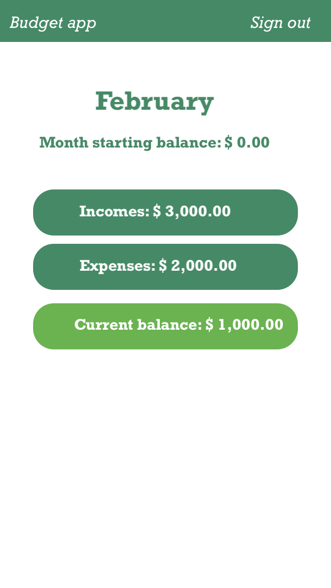
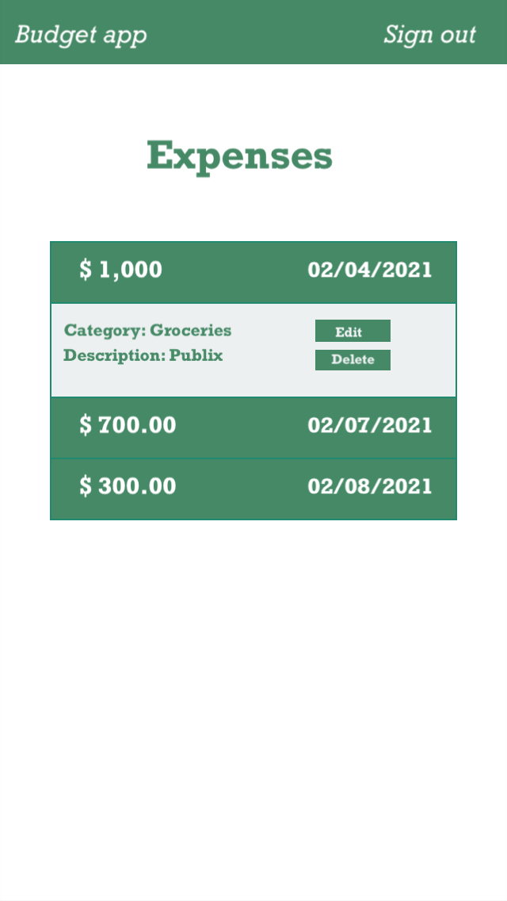

# Budget app

Don't know how you expend all your money ? Budget app can help you, This app allows you to track your expenses and incomes easily an get in control of your spending!

### 1. Working Prototype (to do later)

(Example) You can access a working prototype of the React app here: https://your-app-client.herokuapp.com/ and Node app here: https://your-app-server.herokuapp.com/

### 2. User Stories

###### Landing Page (Importance - High) (Est: 1h)

- as a visitor
- I want to understand what I can do with this app (or sign up, or log in)
- so I can decide if I want to use it

###### Login Page (Importance - High) (Est: 3h)

- As a returning register user
- I want to enter my password and username to use this app,
- So I can have access to my account.

###### Sign Up (Importance - High) (Est: 3h)

- As a visitor
- I want to register to use this app
- So I can create a personal account.

###### Home Page (Importance - Medium) (Est: 2h)

- As a logged-in user,
- I want to be able to preview the content of the app,
- So i can decide what section I want to navigate to.
- I can see the total amount of my month expenses.
- I can see the total amount of my month incomes.

###### Expenses Page (Importance - Medium) (Est: 3h)

- As a logged-in user,
- I would be able to see all month expenses,
- I can choose to edit or delete any expense,
- I can filter all expenses by date.

###### New Expense Page (Importance - Medium) (Est: 3h)

- As a logged-in user,
- I would be able to add a new expense.
- The new expense will have date, category, title and amount.

###### Edit Expense Page (Importance - Medium) (Est: 3h)

- As a logged-in user,
- I would be able to edit a existing expense.

###### Incomes Page (Importance - Medium) (Est: 3h)

- As a logged-in user,
- I would be able to see all month incomes,
- I can choose to edit or delete any income,
- I can filter all incomes by date.

###### New Income Page (Importance - Medium) (Est: 3h)

- As a logged-in user,
- I would be able to add a new income.
- The new income will have date, category, title and amount.

###### Edit Income Page (Importance - Medium) (Est: 3h)

- As a logged-in user,
- I would be able to edit a existing income.

### 3. Functionality

The app's functionality includes:

- Every User has the ability to create an account and log in.
- A logged in User has the ability to add see the total amount of incomes and expenses.
- A logged in User can add new incomes and expenses.
- A logged in User can filter incomes and expenses by date.
- A logged in user can delete or edit an income or expense.

### 4. Technology

- Front-End: HTML5, CSS3, JavaScript ES6, React
- Back-End: Node.js, Express.js, Mocha, Chai, RESTful API Endpoints, Postgres
- Development Environment: Heroku, DBeaver

### 5. Wireframes (to do now)

Landing Page
:-------------------------:

Sign Up Page

Log in Page

Dashboard Page

Incomes Page

New Income Page

Edit Income Page

Expenses Page

New Expense Page

Edit Expense Page

### 6. Front-end Structure - React Components Map (to do later)

- (Example) **Index.js** (stateless)
  - **App.js** (stateful)
    - **LandingPage.js** (stateful) - gets the _"prop name"_ and the _"callback prop name"_ from the **App.js**
      - **Login.js** (stateful) -
      - **Register.js** (stateful) -
    - **Navbar.js** (stateless) -

### 7. Back-end Structure - Business Objects

- users (database table)

  - id (auto-generated)
  - username (email validation)
  - password (at least 8 chars, at least one alpha and a special character validation)

- income_categories (database table)

  - id (auto-generated)
  - title (varchar validation)

- incomes (database table)

  - id (auto-generated)
  - user_id (foreign key from users table)
  - date (date validation)
  - description (varchar (255) not null)
  - amount (double not null )
  - income_category_id (foreign key from income_category table);

- expense_categories (database table)

  - id (auto-generated)
  - title (varchar validation)

- expenses (database table)
  - id (auto-generated)
  - user_id (foreign key from users table)
  - date (date validation)
  - description (varchar (255) not null)
  - amount (double not null )
  - expense_category_id (foreign key from income_category table);

### 8. API Documentation (to do later)

API Documentation details:

- (Example) get all users

### 9. Screenshots (to do later)

(Example) Landing Page
:-------------------------:

Register Page

### 10. Development Roadmap (to do later)

This is v1.0 of the app, but future enhancements are expected to include:

- (Example) add more functionality

### 11. How to run it (done)

Use command line to navigate into the project folder and run the following in terminal

##### Local React scripts

- To install the react project ===> npm install
- To run react (on port 3000) ===> npm start
- To run tests ===> npm run test

##### Local Node scripts

- To install the node project ===> npm install
- To migrate the database ===> npm run migrate -- 1
- To run Node server (on port 8000) ===> npm run dev
- To run tests ===> npm run test
